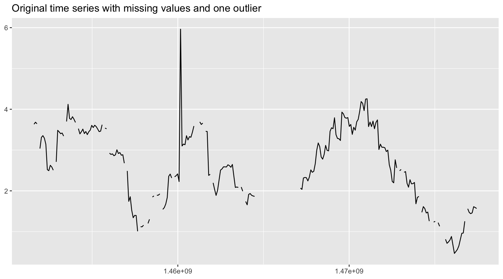
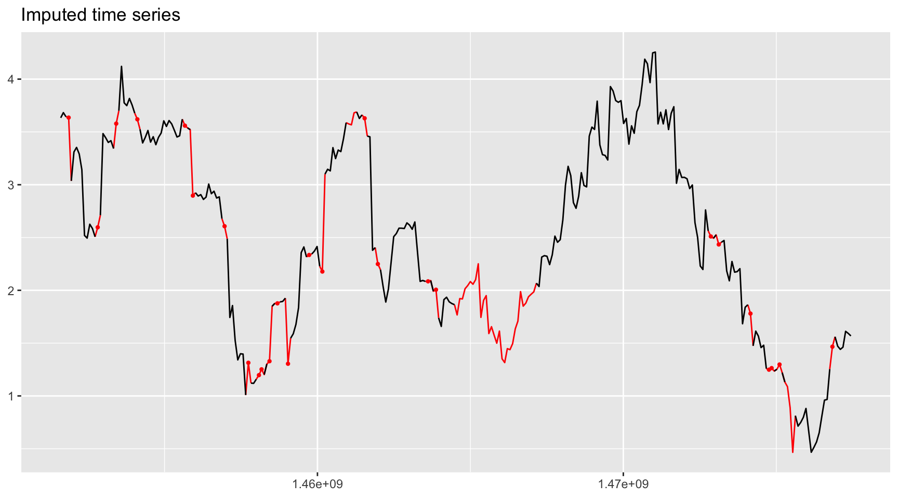

<!-- README.md is generated from README.Rmd. Please edit that file -->


# imputeFin
[](https://CRAN.R-project.org/package=imputeFin)
[](https://CRAN.R-project.org/package=imputeFin)
[](https://CRAN.R-project.org/package=imputeFin)

Missing values often occur in financial data due to a variety 
of reasons (errors in the collection process or in the processing stage, 
lack of asset liquidity, lack of reporting of funds, etc.). However, 
most data analysis methods expect complete data and cannot be employed 
with missing values. One convenient way to deal with this issue without 
having to redesign the data analysis method is to impute the missing 
values. This package provides an efficient way to impute the missing 
values based on modeling the time series with a random walk or an 
autoregressive (AR) model, convenient to model log-prices and log-volumes 
in financial data. In the current version, the imputation is 
univariate-based (so no asset correlation is used). In addition,
outliers can be detected and removed.

The package is based on the paper:   
J. Liu, S. Kumar, and D. P. Palomar (2019). Parameter Estimation of 
Heavy-Tailed AR Model With Missing Data Via Stochastic EM. _IEEE Trans. on 
Signal Processing_, vol. 67, no. 8, pp. 2159-2172.
https://doi.org/10.1109/TSP.2019.2899816


## Installation
The package can be installed from [CRAN](https://CRAN.R-project.org/package=imputeFin) or [GitHub](https://github.com/dppalomar/imputeFin):

```r
# install stable version from CRAN
install.packages("imputeFin")

# install development version from GitHub
devtools::install_github("dppalomar/imputeFin")
```

To get help:

```r
library(imputeFin)
help(package = "imputeFin")
?impute_AR1_Gaussian
vignette("ImputeFinancialTimeSeries", package = "imputeFin")
RShowDoc("ImputeFinancialTimeSeries", package = "imputeFin")
```

To cite package `imputeFin` or the base reference in publications:

```r
citation("imputeFin")
```


## Quick Start
Let's load some time series data with missing values for illustration purposes:

```r
library(imputeFin)
data(ts_AR1_t)
names(ts_AR1_t)
#> [1] "y_missing" "phi0"      "phi1"      "sigma2"    "nu"
```

We can then impute one of the time series and plot it:


```r
y_missing      <- ts_AR1_t$y_missing[, 3]
y_missing[100] <- 2*y_missing[100]  # create an outlier
plot_imputed(y_missing, title = "Original time series with missing values and one outlier")
```



```r
y_imputed <- impute_AR1_t(y_missing, remove_outliers = TRUE)
plot_imputed(y_imputed)
```




## Documentation
For more detailed information, please check the
[vignette](https://CRAN.R-project.org/package=imputeFin/vignettes/ImputeFinancialTimeSeries.html).

## Links
Package: [CRAN](https://CRAN.R-project.org/package=imputeFin) and [GitHub](https://github.com/dppalomar/imputeFin).

README file: [GitHub-readme](https://github.com/dppalomar/imputeFin/blob/master/README.md).

Vignette: [CRAN-vignette](https://CRAN.R-project.org/package=imputeFin/vignettes/ImputeFinancialTimeSeries.html).

